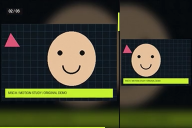

# MSCH Slideshow

Photo slideshow studio with animated layouts, beat analysis, subject framing, editable shot plans and streamed video export.

[Node reference](docs/NODES.md) · [Example workflows and results](examples/README.md) · [Publishing guide](PUBLISHING.md)



[Play / download the rendered demo](examples/results/demo.mp4)

## Included nodes

| Node | What it does |
|---|---|
| [marioslideshow](docs/NODES.md#marioslideshow) | Render a complete photo promo from an uploaded photo collection, folder or IMAGE batch. |
| [marioslideshow - Load Images](docs/NODES.md#marioslideshowloadimages) | Load or upload an ordered photo collection while preserving each image's original aspect ratio. |
| [marioslideshow - Extract Frames](docs/NODES.md#marioslideshowframes) | Extract a bounded range from the original Slideshow VIDEO output as an IMAGE batch. |
| [marioslideshow - Beat Analyzer](docs/NODES.md#mariobeatanalyzer) | Analyze a supplied soundtrack for musical beat times, with optional tempo hint and timing offset. |
| [marioslideshow - Subject Framer](docs/NODES.md#mariosubjectframer) | Compute framing guidance for the source photos using detected faces, masks or a manually chosen focal point. |
| [marioslideshow - Director](docs/NODES.md#marioslideshowdirector) | Plan photo order, shot durations, scenes, transitions and headlines without rendering frames. |
| [marioslideshow - Renderer](docs/NODES.md#marioslideshowrenderer) | Render an existing MARIO_PLAN using the source photos, optional framing guidance and soundtrack. |

## Installation

Clone into `ComfyUI/custom_nodes`:

```bash
git clone https://github.com/mariobilly/msch-slideshow.git
```

Open a terminal in the cloned folder and install requirements using **the same Python environment as ComfyUI**:

```bash
python -m pip install -r requirements.txt
```

Windows portable, from `ComfyUI_windows_portable`:

```powershell
.\python_embeded\python.exe -m pip install -r .\ComfyUI\custom_nodes\msch-slideshow\requirements.txt
```

Restart ComfyUI and refresh the browser. Load a JSON workflow from `examples/` and select the supplied demo input or your own media. Keep only one installed copy of each package to avoid duplicate node registrations.

## Requirements and behavior

Includes a one-node slideshow renderer and a modular seven-node workflow. Optional beat analysis and advanced subject framing use requirements-advanced.txt. Upload photos in the browser or select a local input folder. Native VIDEO output requires a compatible ComfyUI version. Rendering streams to disk; extracting IMAGE frames allocates a bounded batch.

Install `requirements-advanced.txt` to enable optional music beat analysis and advanced framing.

## Documentation and examples

[docs/NODES.md](docs/NODES.md) documents every input, default, range, choice and output. [examples/README.md](examples/README.md) explains which inputs and other nodes each workflow needs and how the included results were produced.

## ComfyUI Manager

The release includes Comfy Registry metadata and a GitHub publishing action. **Registry publication is pending publisher setup**. A separate ComfyUI Manager node-list registration is being submitted; listing is pending maintainer acceptance. Git installation works independently. See [PUBLISHING.md](PUBLISHING.md).

## Validation

Imports and input schemas were checked against the local ComfyUI environment with Python 3.12.10, PyTorch 2.10 and CUDA available. Example render coverage is documented per workflow; this is not a claim of compatibility testing on every platform or of full MiniMax H3 model-generation validation.

## License

Project code: [MIT](LICENSE). Third-party assets and optional model weights keep their own licenses.
