# MSCH Slideshow showcase

Examples supplied by Mario from the MSCH Node Showcase collection. The output files are preserved as supplied.

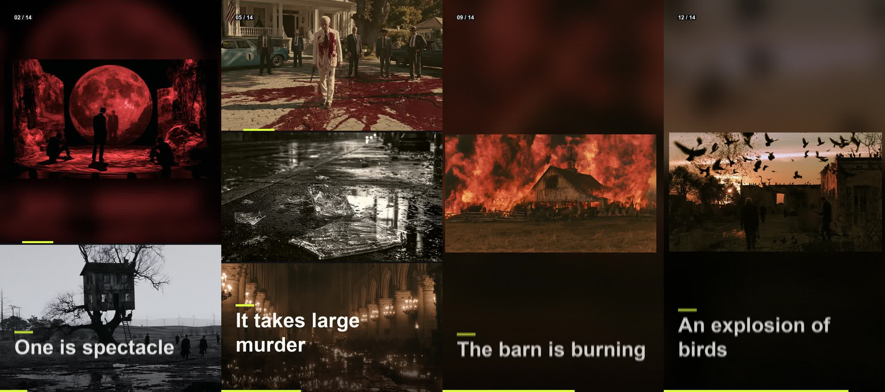

High-energy photo promos with no diffusion model: hero shots, split screens, layered compositions, whip/zoom/shutter transitions, motion blur, headlines, counters, BPM pacing and soundtrack. Native VIDEO output.

- showcase_vertical_high_energy.mp4 - the single marioslideshow node, 1080x1920, BPM 128 / 2 beats per image, Art directed mix, per-image headlines, soundtrack
- showcase_landscape_cinematic_gallery.mp4 - modular chain: Load Images -> Beat Analyzer -> Subject Framer (faces) -> Director (Cinematic gallery) -> Renderer 1920x1080
- contact_sheet / beat_preview / timeline_preview / subject_framing_preview / posters - the diagnostic images each node emits
- extract_frames_into_timeslice.mp4 - Extract Frames pulls 90 frames of the render back into an IMAGE batch and feeds msch-timeslice

## Gallery

Click a video preview to open its file on GitHub, or use the download link.

### Extract frames into timeslice

[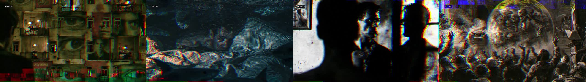](outputs/extract_frames_into_timeslice_00001.mp4)

[Open MP4](outputs/extract_frames_into_timeslice_00001.mp4) · [Download original](https://github.com/mariobilly/msch-slideshow/raw/refs/heads/main/examples/showcase/outputs/extract_frames_into_timeslice_00001.mp4)

### Showcase frames demo source

[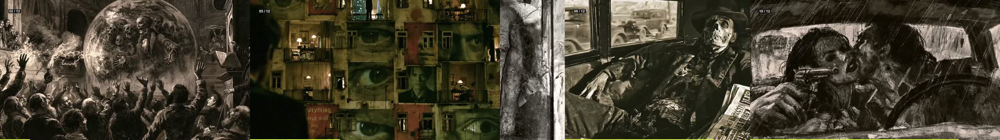](outputs/showcase_frames_demo_source_93e6d73e8a01.mp4)

[Open MP4](outputs/showcase_frames_demo_source_93e6d73e8a01.mp4) · [Download original](https://github.com/mariobilly/msch-slideshow/raw/refs/heads/main/examples/showcase/outputs/showcase_frames_demo_source_93e6d73e8a01.mp4)

### Showcase landscape cinematic gallery

[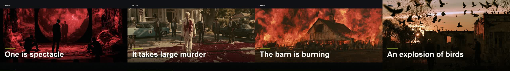](outputs/showcase_landscape_cinematic_gallery_9381f48008ba.mp4)

[Open MP4](outputs/showcase_landscape_cinematic_gallery_9381f48008ba.mp4) · [Download original](https://github.com/mariobilly/msch-slideshow/raw/refs/heads/main/examples/showcase/outputs/showcase_landscape_cinematic_gallery_9381f48008ba.mp4)

### Showcase vertical high energy

[Open MP4](outputs/showcase_vertical_high_energy_6287256e0eb8.mp4) · [Download original](https://github.com/mariobilly/msch-slideshow/raw/refs/heads/main/examples/showcase/outputs/showcase_vertical_high_energy_6287256e0eb8.mp4)

## Still images and diagnostic outputs

### Beat preview

[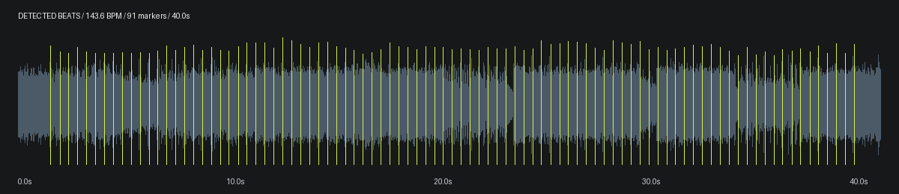](outputs/beat_preview_00002_.png)

### Contact sheet

[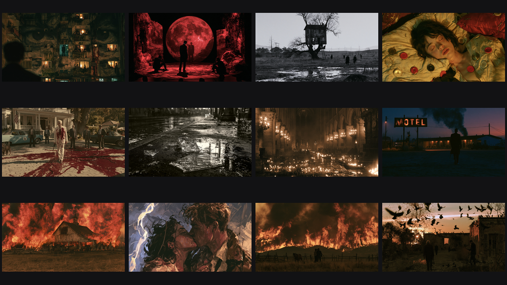](outputs/contact_sheet_00002_.png)

### Landscape poster

[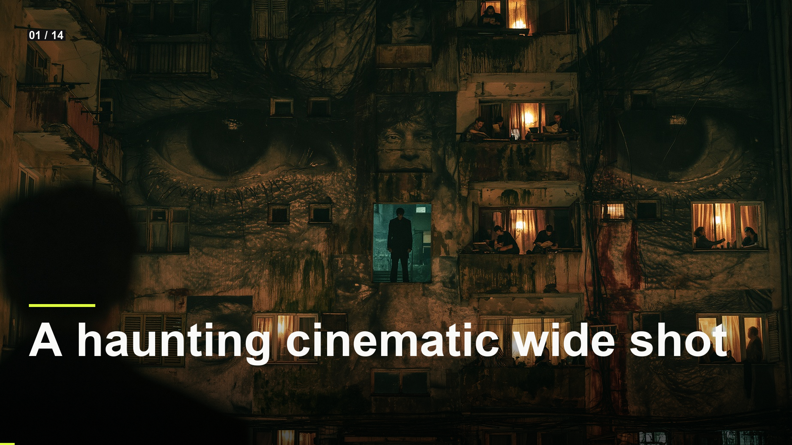](outputs/landscape_poster_00001_.png)

### Showcase frames demo source

[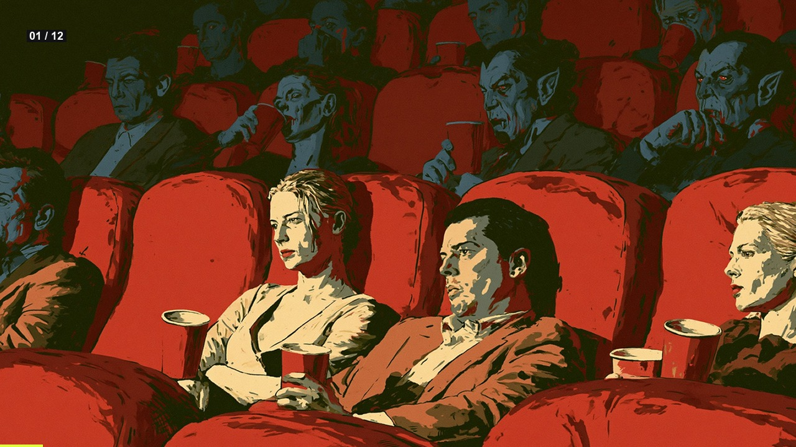](outputs/showcase_frames_demo_source_93e6d73e8a01.jpg)

### Showcase landscape cinematic gallery

[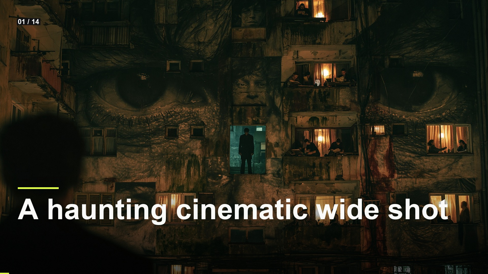](outputs/showcase_landscape_cinematic_gallery_9381f48008ba.jpg)

### Showcase vertical high energy

[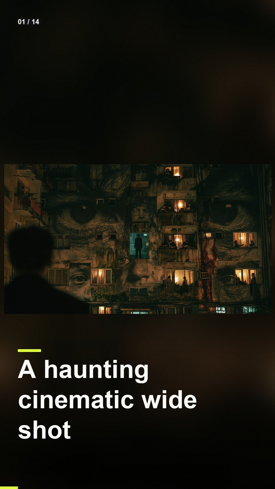](outputs/showcase_vertical_high_energy_6287256e0eb8.jpg)

### Subject framing preview

[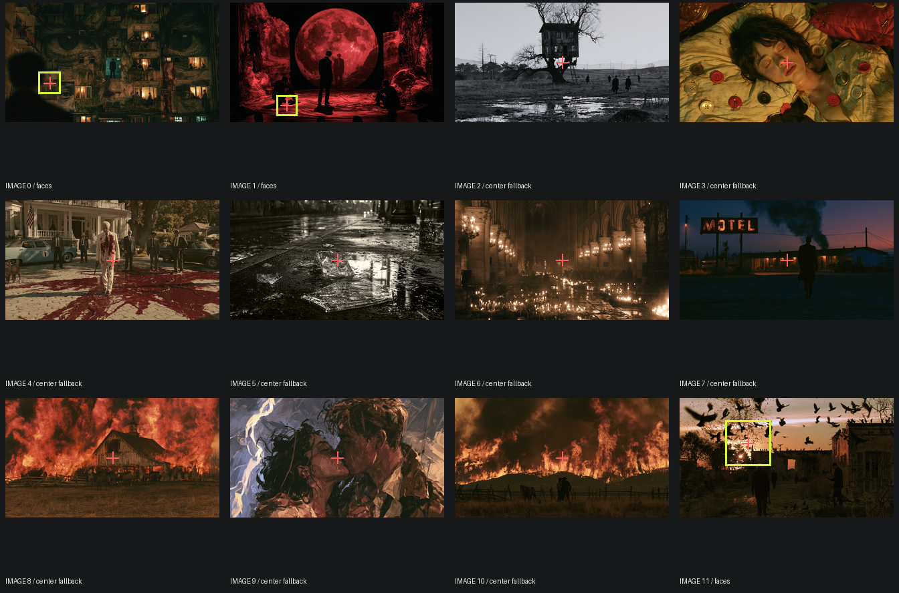](outputs/subject_framing_preview_00002_.png)

### Timeline preview

[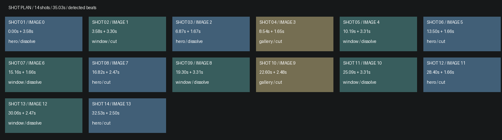](outputs/timeline_preview_00001_.png)

### Vertical poster

[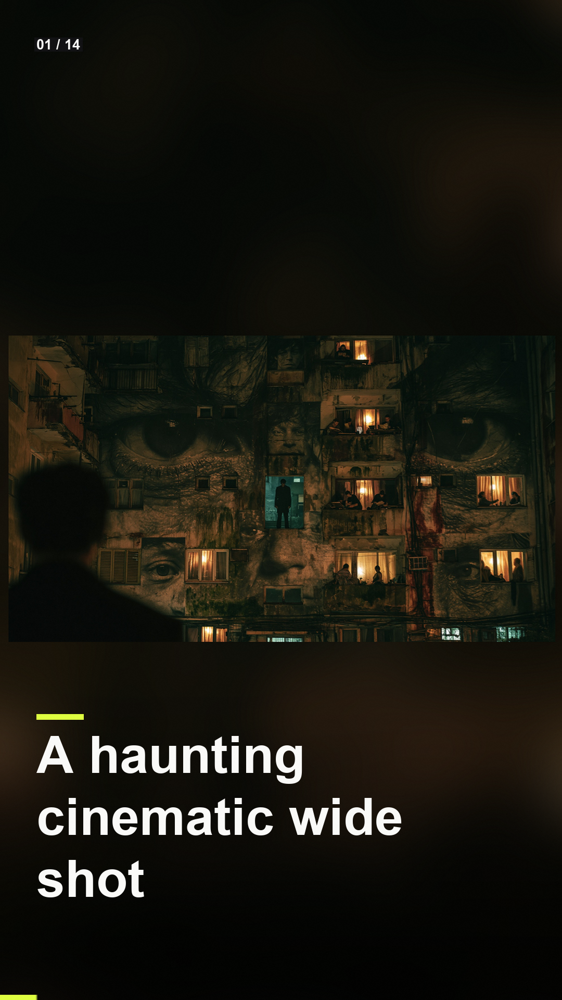](outputs/vertical_poster_00001_.png)

## API workflows

These JSON files are ComfyUI API prompts, not canvas-format workflows. Send one as the `prompt` field of a `/prompt` request, or use a tool that accepts API workflows. A canvas importer may require conversion.

Choose your own source media and installed models before running. Source photos, video clips, audio and model weights are not bundled in this showcase. The supplied render settings and connections are retained; machine-specific absolute paths in the API copies use `INPUT_ROOT/` or `LOCAL_FILES/` placeholders. Replace these with paths valid on your computer.

- [marioslideshow_simple_api.json](workflows_api/marioslideshow_simple_api.json): `SaveImage`, `marioslideshow`.
- [marioslideshow_modular_api.json](workflows_api/marioslideshow_modular_api.json): `LoadAudio`, `MarioBeatAnalyzer`, `MarioSlideshowDirector`, `MarioSlideshowFrames`, `MarioSlideshowLoadImages`, `MarioSlideshowRenderer`, `MarioSubjectFramer`, `SaveImage`, `TimeSlice`, `VHS_VideoCombine`.
- [marioslideshow_frames_demo_api.json](workflows_api/marioslideshow_frames_demo_api.json): `MarioSlideshowFrames`, `TimeSlice`, `VHS_VideoCombine`, `marioslideshow`.

### Input files and models

| Workflow | Node | Input | Source selection |
|---|---|---|---|
| `marioslideshow_simple_api.json` | `1` | `image_folder` | `INPUT_ROOT/msch_showcase/slideshow_a` |
| `marioslideshow_simple_api.json` | `1` | `audio_file` | `INPUT_ROOT/msch_song_40s.mp3` |
| `marioslideshow_modular_api.json` | `1` | `directory` | `INPUT_ROOT/msch_showcase/slideshow_a` |
| `marioslideshow_modular_api.json` | `2` | `audio` | `msch_song_40s.mp3` |
| `marioslideshow_frames_demo_api.json` | `1` | `image_folder` | `INPUT_ROOT/msch_showcase/slideshow_b` |

Install ComfyUI-VideoHelperSuite for the `VHS_*` loader/combine nodes.

The modular/frame extraction workflows also use `msch-timeslice`.

## Saved project and render records

These records are preserved from the supplied outputs. They may contain the original machine paths; update media selections when reusing a saved project.

- [showcase_frames_demo_source_93e6d73e8a01.json](outputs/showcase_frames_demo_source_93e6d73e8a01.json)
- [showcase_landscape_cinematic_gallery_9381f48008ba.json](outputs/showcase_landscape_cinematic_gallery_9381f48008ba.json)
- [showcase_vertical_high_energy_6287256e0eb8.json](outputs/showcase_vertical_high_energy_6287256e0eb8.json)

## Source notes

The collection notes identify images from the Jim Morrison image library, Mario’s clips, and the Suno track “Crushing Syncopation”. Those source assets are not included separately. The rendered media is supplied as showcase material; the repository’s MIT license describes the node code and does not establish a separate license for underlying media.
